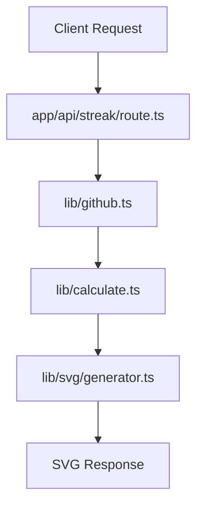

# Architecture

This document explains how a request flows through the SVG rendering pipeline.

## Request → Response Flow

```mermaid
flowchart TD
    A[Client Request] --> B[app/api/streak/route.ts]
    B --> C[lib/github.ts]
    C --> D[lib/calculate.ts]
    D --> E[lib/svg/generator.ts]
    E --> F[SVG Response]
```
