# 🏛️ Theme Gallery

This gallery provides a visual reference for all available color themes in CommitPulse. To use a theme, pass the **Theme Key** to the `theme` parameter in your URL.

**Example Usage:**
`/api/streak?user=yourusername&theme=aurora`

| # | Theme Name | Theme Key | Preview | Description |
| :--- | :--- | :--- | :---: | :--- |
| 1 | **Aurora** | `aurora` | 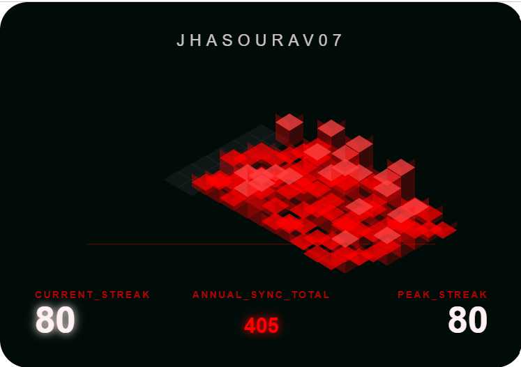 | Deep red northern lights aesthetic with a dark forest background. |
| 2 | **Cyber Cyan** | `cyber-cyan` | 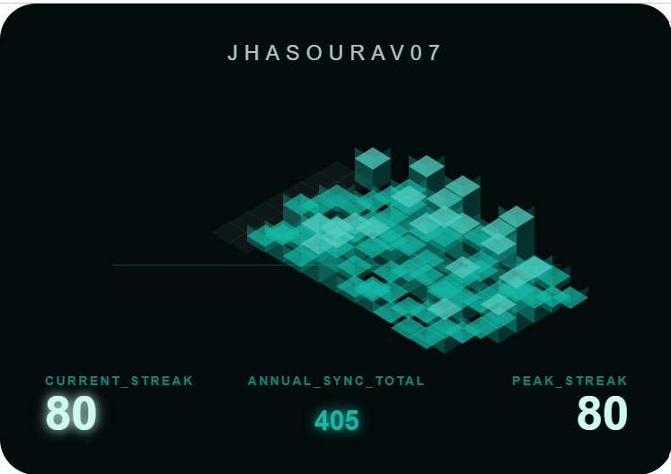 | A clean, futuristic teal glow on a deep obsidian base. |
| 3 | **Dark** | `dark` |  | The classic, professional GitHub dark mode aesthetic. |
| 4 | **Deep Ocean** | `deep-ocean` | 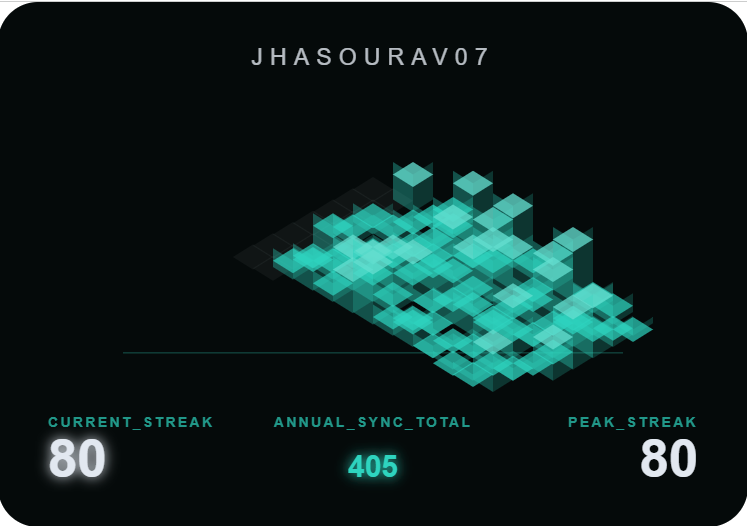 | Submerged dark tones with a soft bioluminescent teal accent. |
| 5 | **Dracula** | `dracula` |  | The iconic high-contrast palette with purple and pink accents. |
| 6 | **Electric Indigo** | `electric-indigo` | 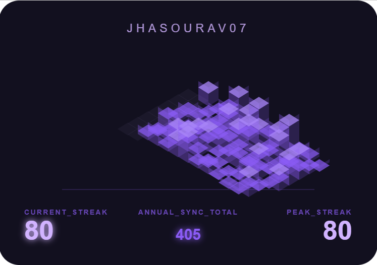 | High-voltage indigo blocks with a sleek, midnight-violet background. |
| 7 | **Ember** | `ember` | 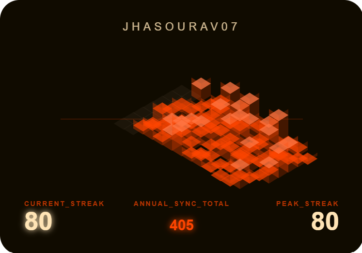 | High-contrast orange glow inspired by heat and burning coals. |
| 8 | **Future Dusk** | `future-dusk` | 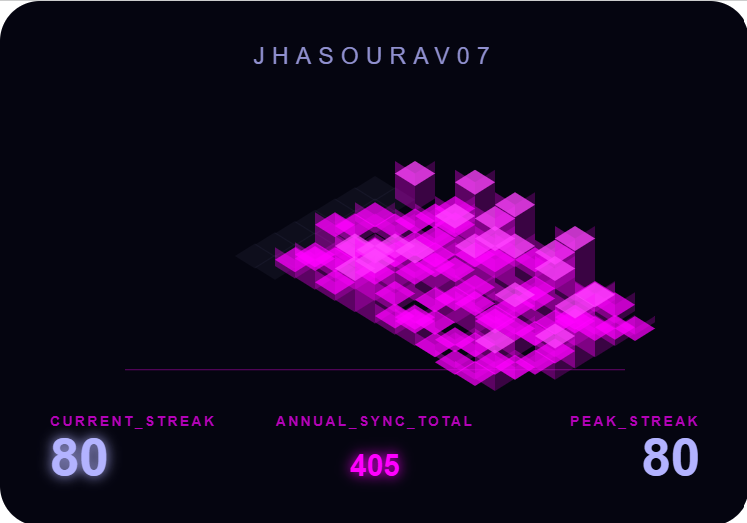 | A moody cosmic purple trend—sophisticated and modern. |
| 9 | **Github** | `github` | 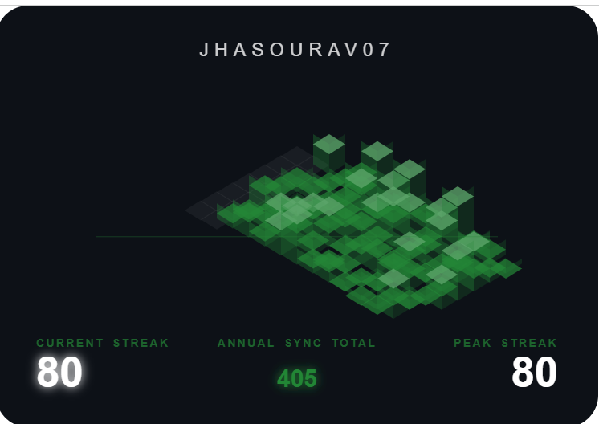 | The traditional GitHub color scheme with solid green accents. |
| 10 | **Hyper Violet** | `hyper-violet` | 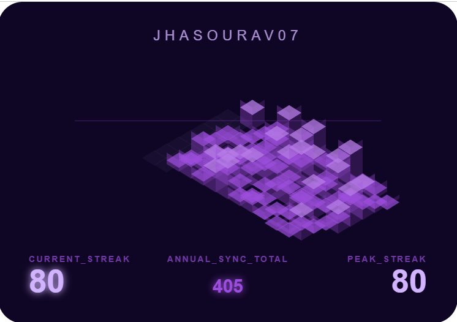 | Vibrant electric violet optimized for high-tech profiles. |
| 11 | **Light** | `light` | 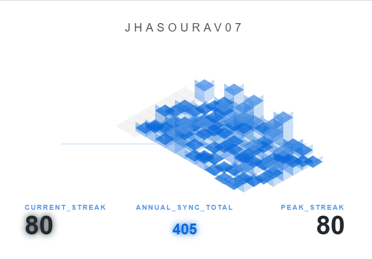 | Clean, professional light mode for high-brightness environments. |
| 12 | **Midnight Purple** | `midnight-purple` | 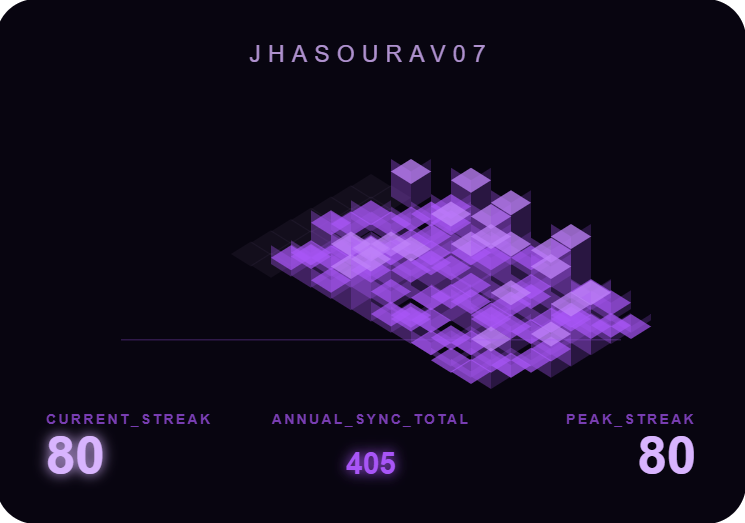 | Deep velvet purple tones with bright lavender highlights. |
| 13 | **Neon** | `neon` | 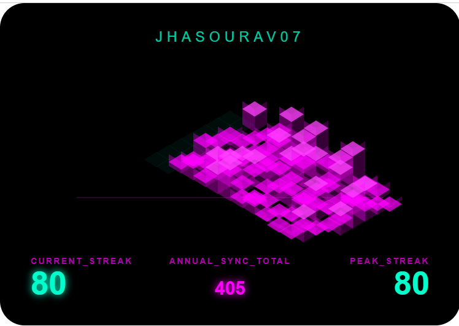 | High-energy black base with neon cyan and magenta retro accents. |
| 14 | **Neon Magenta** | `neon-magenta` | 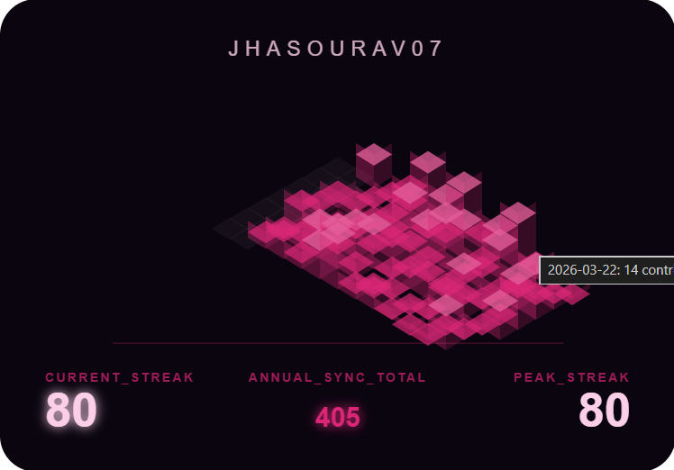 | Sharp, energetic pink glow against a pitch-black background. |
| 15 | **Nord** | `nord` | 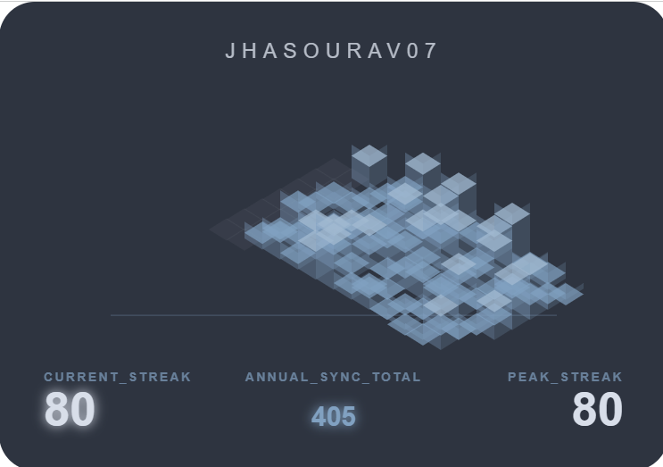 | Arctic-inspired palette providing a cool, minimal frost feel. |
| 16 | **One Dark** | `one-dark` | 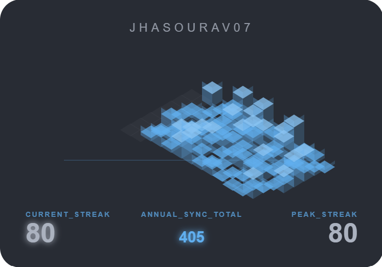 | The classic, high-contrast dark theme inspired by Atom. |
| 17 | **Rose Pine** | `rose-pine` | 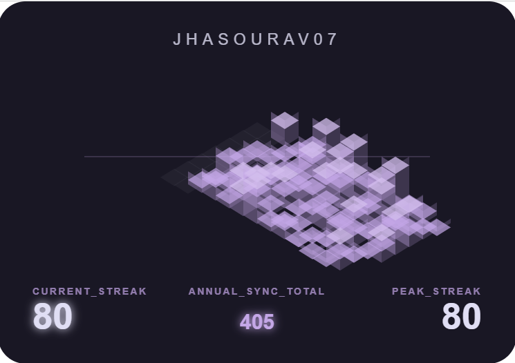 | Ethereal and moody palette with sophisticated purple tones. |
| 18 | **Sunset Burn** | `sunset-burn` | 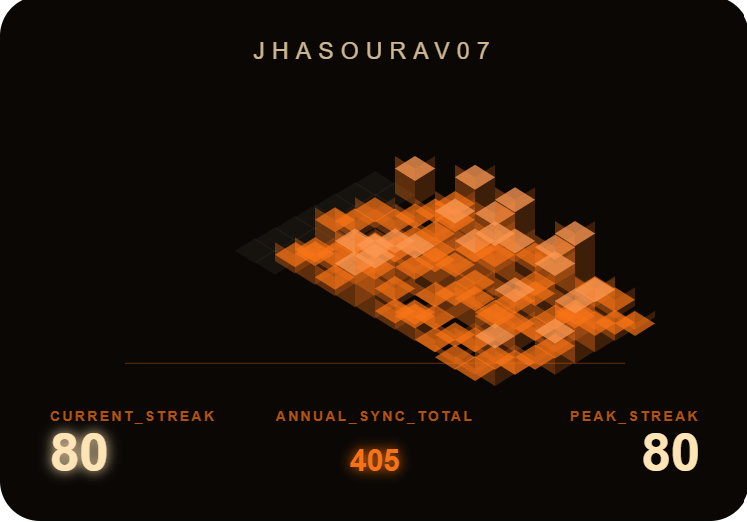 | Fiery orange and amber accents inspired by a deep horizon. |
| 19 | **Synthwave** | `synthwave` |  | Retro-futuristic red-grid aesthetic with high-contrast glowing blocks. |
| 20 | **Tokyo Night** | `tokyo-night` |  | Deep storm-blue with vibrant, high-contrast neon accents. |

---

*Note: Replace `yourusername` with your GitHub username and `aurora` with any other **Theme Key** to see your actual live streak.*