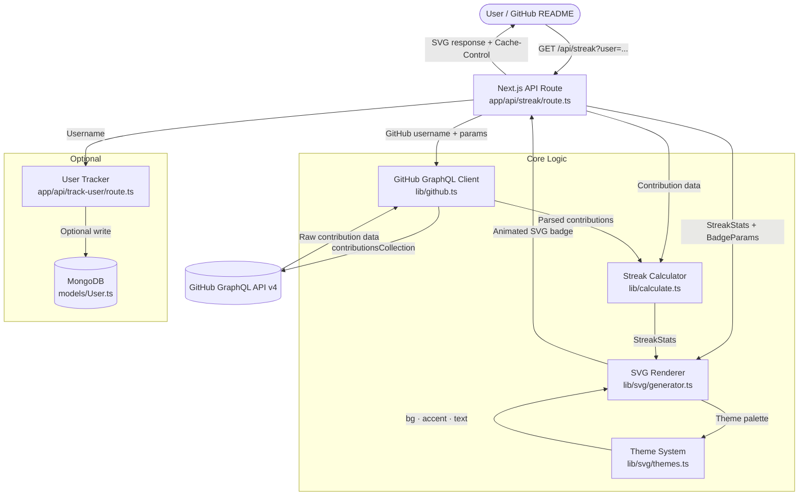

# CommitPulse — Architecture

This document gives new contributors a quick mental model of how CommitPulse is structured, how a badge request flows through the system, and which files to open first.

---

## System Flow

---

## Layer Breakdown

### 1. API Route — `app/api/streak/route.ts`

The single entry point for every badge request. It parses all URL parameters (`user`, `theme`, `bg`, `accent`, `tz`, etc.), orchestrates the other layers in sequence, and returns the final SVG with the correct `Cache-Control` header (UTC-midnight-synced cache invalidation). Start here when tracing any end-to-end request.

### 2. GitHub GraphQL Client — `lib/github.ts`

Sends a `contributionsCollection` query to the GitHub GraphQL API v4 using the `GITHUB_TOKEN` from the environment. Returns structured contribution data for the past 98 days (or a specific `year` if provided). Requires the `read:user` token scope only.

### 3. Streak Calculator — `lib/calculate.ts`

Pure business logic — no I/O. Takes raw contribution data and computes three values: current streak, longest streak, and annual total. Implements a grace period so a single missed day doesn't break a streak (handles timezone edge cases). All core logic must have exhaustive unit tests in `lib/calculate.test.ts`.

### 4. SVG Renderer — `lib/svg/generator.ts`

The visual heart of CommitPulse. Takes `StreakStats` and `BadgeParams` and outputs a fully self-contained animated SVG string. Builds the 3D isometric city geometry (tower heights proportional to commit counts), the radar scan line animation, the current-day pulse indicator, and the glow effects via `<feGaussianBlur>` filters. All animations use native SVG `<animate>` — no JavaScript.

### 5. Theme System — `lib/svg/themes.ts`

Defines the built-in theme presets (`dark`, `neon`, `dracula`, `gruvbox`, etc.) as typed `BadgeTheme` objects with three properties: `bg`, `accent`, and `text`. The renderer applies the priority chain `URL param → theme default → system fallback`. New themes are added here.

### 6. Time Utilities — `utils/time.ts`

Handles UTC midnight synchronisation so the "today" boundary aligns with the correct local day when a `?tz=` parameter is provided. Edge-case-heavy; all changes must be backward-compatible and well-commented.

### 7. User Tracker — `app/api/track-user/route.ts` _(optional)_

Records the GitHub username of anyone who generates a badge from the landing page into MongoDB. Degrades gracefully if `MONGODB_URI` is not set — the main badge route is completely unaffected.

### 8. MongoDB Connection — `lib/mongodb.ts`

Cached connection utility designed for serverless environments (Vercel). Prevents connection pool exhaustion on repeated cold starts.

---

## Key Files

| File                      | What it does                                                       |
| ------------------------- | ------------------------------------------------------------------ |
| `app/api/streak/route.ts` | Main API route — parses params, orchestrates layers, returns SVG   |
| `lib/github.ts`           | GitHub GraphQL API client                                          |
| `lib/calculate.ts`        | Streak algorithm (current + longest + grace period)                |
| `lib/svg/generator.ts`    | 3D isometric SVG renderer + CSS animations                         |
| `lib/svg/themes.ts`       | Built-in theme palette system                                      |
| `utils/time.ts`           | UTC midnight synchronisation utilities                             |
| `types/index.ts`          | TypeScript interfaces (`StreakStats`, `BadgeParams`, `BadgeTheme`) |
| `models/User.ts`          | Mongoose User schema (optional tracking)                           |
| `lib/mongodb.ts`          | Cached MongoDB connection utility                                  |

---

## Data Flow in Plain English

1. A GitHub README embeds a CommitPulse URL (e.g. `https://commitpulse.vercel.app/api/streak?user=jhasourav07&theme=neon`).
2. The Next.js API route parses the URL parameters and validates the input.
3. `lib/github.ts` queries the GitHub GraphQL API for the user's contribution history.
4. `lib/calculate.ts` computes the current streak, longest streak, and annual total from the raw data.
5. `lib/svg/generator.ts` fetches the appropriate theme from `lib/svg/themes.ts` and renders the 3D isometric city as a self-contained SVG string with embedded animations.
6. The API route returns the SVG with a `Cache-Control` header timed to expire at the next UTC midnight.
7. Optionally, `app/api/track-user` records the username to MongoDB.

---

## Getting Oriented as a New Contributor

1. **Run it locally first** — follow the setup in `CONTRIBUTING.md` and hit `http://localhost:3000/api/streak?user=YOUR_USERNAME` to see a live render.
2. **Read `lib/svg/generator.ts`** if you're working on themes or visual changes — it's the most complex file in the codebase.
3. **Read `lib/calculate.ts`** if you're touching streak or timezone logic — every function must have tests in `lib/calculate.test.ts`.
4. **Adding a theme?** Edit only `lib/svg/themes.ts` and update the theme table in `README.md`.
5. **Run `npm run format && npm run lint && npm run test`** before every push — CI will block your PR if any check fails.
